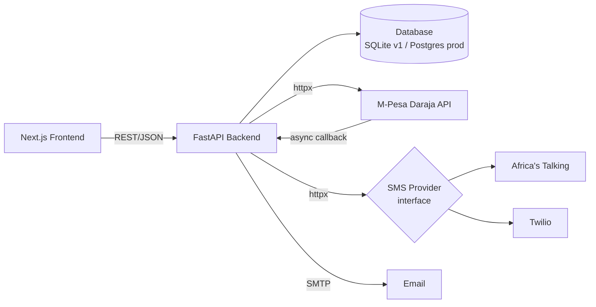
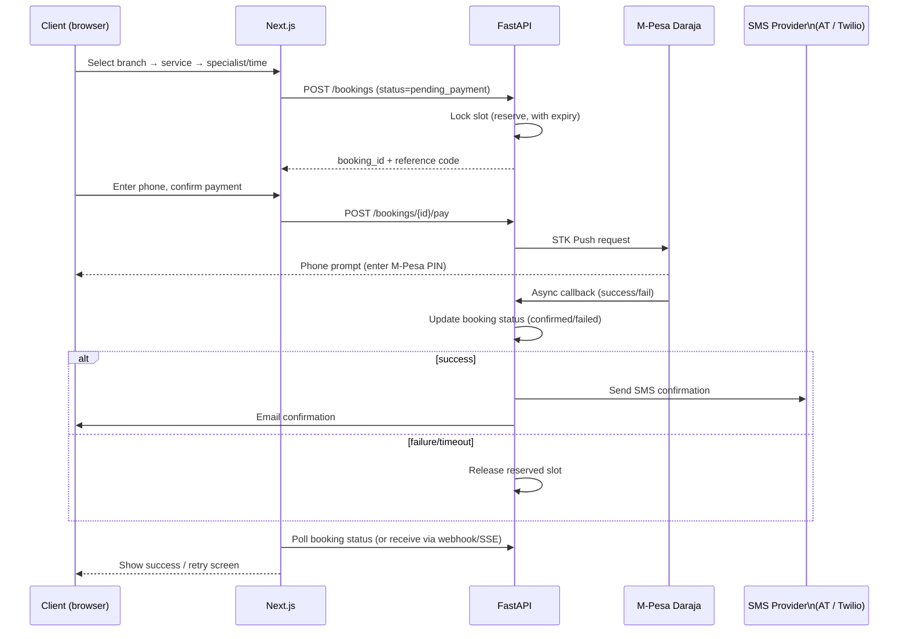

# Rolin Barbershop & Spa — Project Documentation

This is the engineering reference for the booking platform: requirements, architecture, data model, API surface, and the points most likely to break in production if skipped. Pair this with `README.md` (setup) and `rolin-barbershop-spa-stitch-design-brief.md` (UI/UX spec).

---

## 1. Requirements

### 1.1 Functional Requirements

**Public / client-facing**
- Browse services by category (Barbershop, Hair & Locs, Nails, Facials, Massage & Spa, Waxing), priced in KES
- View both branches (Ruaka, Kiambu Road) with address, hours, and contact
- Book an appointment as a guest (no account) or as a logged-in client, in this order: branch → service(s) → specialist & time → payment
- Pay via M-Pesa STK Push; receive SMS + email confirmation with a unique reference code
- Track a booking by reference code without logging in
- Logged-in clients can view upcoming bookings, history, reschedule/cancel, and edit basic profile info

**Admin / staff-facing**
- View and filter bookings by branch, date, specialist, status
- Manage services (CRUD, grouped by category, KES pricing)
- Manage specialists (assign to branch + services, toggle availability)
- Manage branch details (address, phone, hours)
- View payment transactions with M-Pesa reference
- Dashboard overview: today's bookings, weekly revenue, pending payments, active specialists — filterable by branch

### 1.2 Non-Functional Requirements

- **Correctness over speed for payments** — a booking must never be marked "Confirmed" until the M-Pesa callback explicitly confirms success.
- **No double-booking** — two clients must never be able to hold the same specialist/branch/time-slot simultaneously.
- **Guest-first** — booking and tracking must work fully without an account; login is a convenience, not a requirement.
- **Kenya-specific correctness** — phone numbers normalized to `+254...`, all prices displayed as `KSh X,XXX`, all timestamps stored in UTC and displayed in `Africa/Nairobi` time.
- **Branch isolation where it matters** — specialists, availability, and admin views are branch-scoped; reporting can aggregate across branches.
- **Resilience to third-party failure** — if M-Pesa or the SMS provider is slow/down, the booking record must still exist in a sane intermediate state (not silently lost).

---

## 2. System Architecture

- **SMS is provider-agnostic by design.** The backend talks to one internal `SMSProvider` interface (`send(to, message)`); `AfricasTalkingProvider` and `TwilioProvider` are two interchangeable implementations behind it, selected by the `SMS_PROVIDER` env var. Nothing else in the codebase should ever import Africa's Talking or Twilio SDK calls directly — only `services/sms/` does. This means switching providers later (or running both, e.g. Africa's Talking primary with Twilio as a fallback) is a config change, not a rewrite.

- **Frontend (Next.js)** never talks to M-Pesa or Africa's Talking directly — it only talks to the FastAPI backend. All third-party integration and secrets live server-side.
- **Backend (FastAPI)** owns all business logic: slot-conflict checks, payment state machine, notification dispatch.
- M-Pesa STK Push is **asynchronous**: the initial request only confirms the prompt was sent to the customer's phone. The actual payment result arrives later via a callback webhook — this shapes a lot of the booking state machine (see Section 3 and Section 7, point 2).

---

## 3. Booking Flow (end-to-end)

Key implication: the slot must be **reserved-but-not-confirmed** the moment a client reaches the payment step, with a short expiry (e.g. 5–10 minutes). If payment doesn't complete in time, the reservation is released so the slot doesn't get stuck "held" forever by an abandoned checkout.

---

## 4. Data Model (core entities)

| Entity | Key fields |
|---|---|
| `Branch` | id, name, address, phone, opening_hours |
| `ServiceCategory` | id, name (Barbershop, Hair & Locs, Nails, Facials, Massage & Spa, Waxing) |
| `Service` | id, category_id, name, price_kes, duration_minutes |
| `Specialist` | id, branch_id, name, specialty_tag, photo_url, is_active |
| `SpecialistService` | specialist_id, service_id (many-to-many: which services each specialist offers) |
| `Client` | id (nullable for guests), name, phone (+254 normalized), email, password_hash (if registered) |
| `Booking` | id, reference_code (unique, public), branch_id, client_id (nullable), specialist_id, service_ids, scheduled_at, status, total_kes, created_at |
| `Payment` | id, booking_id, mpesa_checkout_request_id, mpesa_receipt_number, amount_kes, status, raw_callback_payload |
| `AdminUser` | id, name, email, password_hash, role (super_admin / branch_manager), branch_id (nullable for super_admin) |

**Booking.status** state machine: `pending_payment` → `confirmed` → `completed` | `cancelled` | `payment_failed` → (expired reservations auto-revert to `expired`/slot released).

---

## 5. SMS Provider: Africa's Talking vs Twilio

Both sit behind the same `SMSProvider` interface (Section 2), so this is a config decision, not a code decision — pick one to launch with, and the other stays available as a drop-in fallback later.

| | Africa's Talking | Twilio |
|---|---|---|
| Kenya sender ID | Custom alphanumeric sender ID (e.g. "ROLIN") is straightforward to set up for local routes | Sending from a custom alphanumeric sender ID into Kenya requires a pre-registration process with supporting documents submitted to the Kenyan network operators |
| Local delivery reliability | Built specifically for African carriers (Safaricom, Airtel) — generally strong local delivery | Strong globally, but unregistered alphanumeric sender traffic can see lower delivery quality or be blocked outright by local carriers that filter non-registered messages |
| Setup speed for an MVP | Fast — sandbox + sender ID approval is usually quick for Kenya-only traffic | Slower if you want a branded sender ID, since Kenyan carriers require document-backed registration before an alphanumeric ID is approved; using a plain Twilio number instead of a branded ID avoids this but loses the "ROLIN" sender name |
| Best fit here | Kenya-only traffic, fastest path to a branded sender ID, what most of your past Kenya SME builds have used | A good fallback/secondary provider, or the right call if Rolin ever needs SMS to clients outside Kenya, or you want Twilio's broader platform (WhatsApp, voice) later |

**Recommendation for v1:** default to Africa's Talking (`SMS_PROVIDER=africastalking`) since this is 100% Kenya-local traffic and you want the branded sender ID live fast without a carrier registration delay. Keep the Twilio implementation built and tested behind the same interface so it's a one-line env change if Africa's Talking has an outage or you expand beyond Kenya.

---

## 6. API Surface (high level)

| Route | Method | Purpose |
|---|---|---|
| `/branches` | GET | List branches |
| `/services?category=` | GET | List services, optionally filtered |
| `/specialists?branch_id=&service_id=` | GET | List available specialists |
| `/availability?specialist_id=&date=` | GET | Available time slots |
| `/bookings` | POST | Create a reserved (pending_payment) booking |
| `/bookings/{id}/pay` | POST | Trigger M-Pesa STK Push for a booking |
| `/payments/mpesa/callback` | POST | Webhook — M-Pesa calls this, never the frontend |
| `/bookings/track/{reference_code}` | GET | Public lookup, no auth |
| `/bookings/{id}` | PATCH | Reschedule/cancel (client, own booking only) |
| `/auth/login`, `/auth/register` | POST | Client auth (optional account) |
| `/admin/...` | various | Admin CRUD, JWT-protected, role/branch-scoped |

Full request/response schemas live in the auto-generated OpenAPI doc at `/openapi.json` once the backend is running — treat that as the source of truth over this table, and regenerate frontend types from it (see README).

---

## 7. Critical Points — read this before building

These are the parts most likely to cause real bugs or real money issues if glossed over.

1. **Slot conflicts need a DB-level guarantee, not just app-level checks.** Two requests can race past an "is this slot free?" check before either writes. Use a unique constraint on `(specialist_id, scheduled_at)` (or a short reservation row with an expiry) so the database itself rejects the second booking, not just your Python logic.

2. **Never trust the STK Push initiation response as proof of payment.** It only means the prompt reached the phone. The booking only becomes `confirmed` when the **callback** arrives and reports success. Build the UI around this asynchronous reality (a "waiting for confirmation" state with polling or SSE), not around an immediate success response.

3. **Make the M-Pesa callback idempotent.** Safaricom can retry the callback. Key your update on `mpesa_checkout_request_id` and check current status before applying — never double-process a confirmation (e.g. double-sending the SMS).

4. **Validate the callback is genuinely from M-Pesa**, not just any POST to that URL. At minimum, don't expose internal booking IDs in the callback URL in a way that lets someone guess/forge a "successful payment" callback. Treat the callback endpoint as untrusted input and re-derive state from your own records, not from whatever the payload claims.

5. **Phone number normalization happens once, at the edge.** Accept `07...`, `+254...`, or `254...` from users, normalize to `+254XXXXXXXXX` immediately on input (both client form validation and a backend re-check), and store/use that one canonical format everywhere — especially before sending to M-Pesa or the SMS provider, both of which expect a specific format.

6. **Timezone discipline.** Store every timestamp in UTC in the database. Convert to `Africa/Nairobi` only at the display layer (frontend, or SMS message text). Mixing naive local-time storage with UTC comparisons is a common source of "the slot showed available but wasn't" bugs.

7. **Reserved-but-unpaid bookings must expire.** Without an expiry + cleanup job (cron/APScheduler/systemd timer), abandoned checkouts will permanently lock real slots. Decide the expiry window (5–10 min is reasonable) up front.

8. **Branch-scoping for admin auth.** A branch manager account must not see or edit the other branch's bookings/specialists. Enforce this in the backend query layer (filter by `branch_id` from the JWT claim), not just by hiding it in the UI — a hidden-but-reachable endpoint is not access control.

9. **CORS and secrets boundary.** FastAPI's `CORS_ORIGINS` should be an explicit allowlist (your real frontend domain), not `*`, once this is live. M-Pesa and SMS provider credentials live only in backend environment variables — never in any frontend bundle or repo.

10. **Guest reference codes must be unguessable enough to not be a privacy leak**, but still short enough for a customer to read over the phone. A short random alphanumeric code (not a sequential integer) backed by a unique index is the right balance — sequential IDs let one guest enumerate other people's bookings.

11. **If you ever go live with Twilio's alphanumeric sender ID for Kenya, budget time for carrier pre-registration.** It's a documents-and-approval process, not an instant toggle — don't assume it'll be ready by launch day if you switch providers late.

---

## 8. Deployment Notes (Hetzner VPS)

- **Process management:** run `uvicorn` behind `gunicorn` (or `uvicorn --workers N`) as a systemd service for the backend; run `next start` (or PM2) as a systemd service for the frontend.
- **Reverse proxy:** Nginx terminates SSL (Certbot/Let's Encrypt) and routes `/` to the Next.js process, `/api/` to FastAPI. WebSocket/SSE routes (if used for payment-status polling) need `proxy_set_header Upgrade`/`Connection` passed through.
- **Database:** SQLite is fine for initial development and low-traffic launch, but plan the move to PostgreSQL before relying on this in production with concurrent bookings across two branches — SQLite's single-writer model is the main risk under real concurrent load, not raw performance.
- **Secrets:** `.env` files live on the server outside the git-deployed directory, loaded via systemd's `EnvironmentFile=` directive — never pulled from the repo.
- **Logging:** centralize backend logs (stdout → journald is enough at this scale) and at minimum log every payment state transition with the booking reference code, for support/debugging when a client says "I paid but it shows pending."

---

## 9. Testing Strategy

Build and test bottom-up — verify each piece in isolation before wiring it into the next layer:

1. `mpesa.py` service — unit test the STK push request builder and callback parser against recorded sandbox payloads, with no live network calls in CI.
2. `services/sms/` — test the shared interface against **both** `AfricasTalkingProvider` and `TwilioProvider` with mocked HTTP calls, so switching `SMS_PROVIDER` later doesn't ship untested code.
3. Booking conflict logic — isolated tests asserting the DB rejects overlapping reservations.
4. Router-level tests (FastAPI `TestClient`) — exercise the public API surface end-to-end against a test database.
5. Frontend — component tests for the booking-flow state machine (Zustand store), then a small number of E2E tests (Playwright) covering the full guest booking happy path and one payment-failure path.

Only after each layer passes in isolation, wire the frontend against the real backend locally, then against staging.

---

## 10. Roadmap (post-v1)

- Migrate SQLite → PostgreSQL
- Add Swahili language toggle
- Loyalty/rewards program
- Recurring bookings (e.g. monthly haircut)
- WhatsApp notifications alongside SMS
- Multi-tenant version of this same platform for other Kenyan SME clients (reusable booking engine)